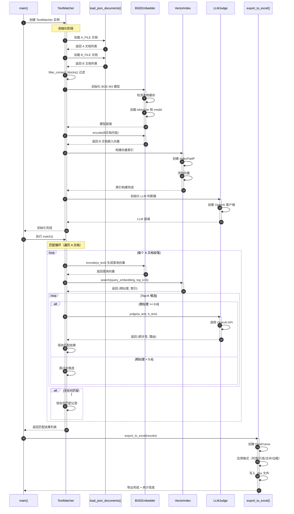

# General_text_matching.py 通用条款匹配系统文档

## 目录

- [系统概述](#系统概述)
- [执行顺序详解](#执行顺序详解)
- [时序图](#时序图)
- [核心组件](#核心组件)
- [配置说明](#配置说明)
- [依赖环境](#依赖环境)

---

## 系统概述

`General_text_matching.py` 是一个**通用的两阶段责任标准文档比对系统**，适用于任意两个责任标准文档的语义比对。

### 核心功能

1. **语义向量召回**：使用 BGE-M3 模型生成文本嵌入向量，通过 FAISS 进行向量相似度检索
2. **LLM 精细判断**：对召回的候选进行 GPT-3.5-turbo 语义相关性分类（不相关/弱相关/强相关）
3. **Excel 格式导出**：带格式的 Excel 输出，支持合并单元格和样式定制

### 两阶段匹配架构

```
阶段1: 粗匹配（向量召回）
   ↓
阶段2: 精匹配（LLM判断）
   ↓
结果导出
```

---

## 执行顺序详解

### 1️⃣ 主程序入口 (`main()`)

```
main()
  ↓
  ├─ 文件存在性检查
  ├─ 创建 TextMatcher 实例
  ├─ 执行 match() 获取结果
  └─ 调用 export_to_excel() 导出
```

**代码位置**: [General_text_matching.py:588-611](General_text_matching.py#L588-L611)

### 2️⃣ TextMatcher 初始化 (`__init__()`)

```
TextMatcher.__init__()
  ↓
  ├─ [步骤1] 加载文档
  │    ├─ load_json_documents(A_FILE)
  │    ├─ load_json_documents(B_FILE)
  │    ├─ filter_content_blocks() 过滤 Preamble
  │    └─ 统计文档数量
  │
  ├─ [步骤2] 初始化 BGE-M3 嵌入模型
  │    ├─ 检测本地缓存
  │    ├─ 加载 BGE-M3 模型
  │    └─ 设置设备 (cuda/cpu)
  │
  ├─ [步骤3] 构建向量索引
  │    ├─ 提取 B 文档 content
  │    ├─ encode() 生成嵌入向量
  │    └─ 构建 FAISS 索引
  │
  └─ [步骤4] 初始化 LLM 判断器
       ├─ 创建 OpenAI 客户端
       └─ 配置 API 连接
```

**代码位置**: [General_text_matching.py:371-408](General_text_matching.py#L371-L408)

### 3️⃣ 匹配流程 (`match()`)

```
match()
  ↓
  for 每个 A 文档段落:
      ↓
      ├─ [1] 向量检索 Top-K
      │    ├─ encode(a_text) → 生成查询向量
      │    └─ vector_index.search() → 召回 Top-K 候选
      │
      ├─ [2] 相似度过滤
      │    └─ if similarity < 0.8: continue
      │
      ├─ [3] LLM 精判
      │    ├─ llm_judge.judge(a_text, b_text)
      │    └─ 返回 (相关性等级, 理由)
      │
      └─ [4] 保存结果
           ├─ 有匹配 → 保存完整信息
           └─ 无匹配 → 保存空匹配记录
```

**代码位置**: [General_text_matching.py:410-467](General_text_matching.py#L410-L467)

### 4️⃣ Excel 导出 (`export_to_excel()`)

```
export_to_excel()
  ↓
  ├─ 创建 DataFrame
  ├─ 调整列顺序
  ├─ 写入 Excel 文件
  ├─ 应用格式:
  │    ├─ 设置列宽
  │    ├─ 设置行高 (200)
  │    ├─ 合并相同 A 文件条款单元格
  │    ├─ 设置对齐方式
  │    └─ 添加边框样式
  └─ 输出统计信息
```

**代码位置**: [General_text_matching.py:469-585](General_text_matching.py#L469-L585)

---

## 时序图



---

## 核心组件

### 1. Config 配置类

**代码位置**: [General_text_matching.py:24-50](General_text_matching.py#L24-L50)

| 配置项 | 默认值 | 说明 |
|--------|--------|------|
| `A_FILE` | `RBA_A.json` | 文档 A 路径 |
| `B_FILE` | `Apple_standard.json` | 文档 B 路径 |
| `OUTPUT_EXCEL` | `General_matching_results.xlsx` | 输出路径 |
| `EMBEDDING_MODEL` | `BAAI/bge-m3` | 嵌入模型 |
| `EMBEDDING_DEVICE` | `cuda/cpu` | 自动检测 |
| `TOP_K` | 6 | 召回候选数 |
| `SIMILARITY_THRESHOLD` | 0.8 | 相似度阈值 |
| `LLM_API_BASE` | `http://10.71.5.24:8000/v1` | LLM API |
| `LLM_MODEL` | `gpt-3.5-turbo` | 判断模型 |

### 2. BGEEmbedder 向量嵌入器

**代码位置**: [General_text_matching.py:150-253](General_text_matching.py#L150-L253)

**功能**: 使用 BGE-M3 模型生成文本嵌入向量

**关键方法**:
- `__init__()`: 加载模型和 tokenizer，支持本地缓存
- `encode(texts)`: 将文本列表编码为向量（批处理，默认 batch_size=32）
- `_mean_pooling()`: 平均池化聚合 token 嵌入

### 3. VectorIndex 向量索引

**代码位置**: [General_text_matching.py:256-271](General_text_matching.py#L256-L271)

**功能**: 基于 FAISS 的向量相似度搜索

**关键方法**:
- `__init__(embeddings)`: 构建内积索引（IndexFlatIP）
- `search(query_embedding, top_k)`: 返回 Top-K 相似向量和分数

### 4. LLMJudge LLM 判断器

**代码位置**: [General_text_matching.py:274-365](General_text_matching.py#L274-L365)

**功能**: 使用 LLM 判断两段文本的相关性

**相关性等级**:
- `不相关`: 两段文本无责任义务关联
- `弱相关`: 主题相似但责任义务不同
- `强相关`: 相同或相似的责任义务要求

**关键方法**:
- `judge(text1, text2)`: 返回 (相关性等级, 理由)
- `_build_prompt()`: 构建结构化判断提示词
- `_parse_result()`: 解析 LLM 返回结果

**重试机制**: 最多 3 次，指数退避（2s, 4s, 6s）

### 5. TextMatcher 主流程编排器

**代码位置**: [General_text_matching.py:368-585](General_text_matching.py#L368-L585)

**功能**: 协调整个匹配流程

**关键方法**:
- `__init__()`: 初始化所有组件
- `match()`: 执行匹配循环
- `export_to_excel()`: 导出带格式的 Excel

### 6. 工具函数

| 函数 | 位置 | 功能 |
|------|------|------|
| `load_json_documents()` | 54-105 | 加载 JSON 文档（支持数组/多行格式） |
| `filter_content_blocks()` | 108-115 | 过滤出 content 字段，排除 Preamble |
| `format_clause_text()` | 118-139 | 格式化条款文本（拼接 id.title） |
| `truncate_text()` | 142-146 | 截断过长文本 |

---

## 配置说明

### 修改输入文件

编辑 `Config` 类的文件路径：

```python
class Config:
    A_FILE = "/path/to/your/document_a.json"
    B_FILE = "/path/to/your/document_b.json"
```

### 调整匹配参数

```python
class Config:
    TOP_K = 6                  # 召回候选数（越大召回越多，但 LLM 调用越多）
    SIMILARITY_THRESHOLD = 0.8  # 相似度阈值（越高越严格）
```

### 更换 LLM 模型

```python
class Config:
    LLM_MODEL = "gpt-4"        # 或其他兼容 OpenAI API 的模型
```

---

## 依赖环境

### 安装依赖

```bash
pip install -r requirements.txt
```

### 核心依赖

| 库 | 版本 | 用途 |
|----|------|------|
| `torch` | - | BGE-M3 模型运行 |
| `transformers` | - | HuggingFace 模型加载 |
| `faiss-cpu` | - | 向量相似度搜索 |
| `openai` | - | LLM API 调用 |
| `pandas` | - | 数据处理 |
| `openpyxl` | - | Excel 导出 |
| `numpy` | - | 数值计算 |
| `tqdm` | - | 进度条 |

### GPU 加速（可选）

```bash
pip install faiss-gpu  # 替换 faiss-cpu
```

脚本会自动检测 CUDA 是否可用。

### 模型缓存

首次运行会自动下载 BGE-M3 模型（约 2GB）到：

```
~/.cache/huggingface/hub/models--BAAI--bge-m3
```

后续运行将使用本地缓存。

---

## 输出格式

### Excel 文件结构

| 列名 | 宽度 | 说明 |
|------|------|------|
| A文件条款 | 60 | A 文档条款内容（合并单元格） |
| B文件条款 | 60 | B 文档匹配的条款内容 |
| 相似度得分 | 15 | 向量相似度分数（0-1） |
| LLM判断结果 | 15 | 不相关/弱相关/强相关 |
| LLM判断理由 | 40 | LLM 判断的简要理由 |
| 排名 | 10 | 在 Top-K 中的排名 |
| A文件路径 | 40 | A 文档的层级路径 |
| B文件路径 | 40 | B 文档的层级路径 |

### 格式特性

- **行高**: 数据行统一 200 像素
- **文本换行**: 所有单元格启用 `wrap_text=True`
- **对齐方式**: 文本列左对齐，数值列居中
- **合并单元格**: 相同的 A 文件条款自动合并
- **边框样式**: 全边框（thin）

---

## 使用示例

### 基本使用

```bash
# 确保已准备好两个 JSON 文档
python General_text_matching.py
```

### 自定义配置

```python
# 修改脚本中的 Config 类
class Config:
    A_FILE = "custom_a.json"
    B_FILE = "custom_b.json"
    TOP_K = 10
    SIMILARITY_THRESHOLD = 0.75
```

### 查看输出

```bash
# 打开生成的 Excel 文件
libreoffice General_matching_results.xlsx
# 或
xdg-open General_matching_results.xlsx
```

---

## 常见问题

### Q1: LLM API 调用失败

**检查**:
- API 服务是否运行: `curl http://10.71.5.24:8000/v1/models`
- 网络连接是否正常
- 是否有 API 访问权限

### Q2: 模型加载失败

**解决**:
```bash
# 删除损坏的缓存
rm -rf ~/.cache/huggingface/hub/models--BAAI--bge-m3

# 重新运行脚本自动下载
python General_text_matching.py
```

### Q3: 内存不足

**解决**:
- 减小 `batch_size`（默认 32）
- 使用更小的 `TOP_K` 值
- 启用 GPU 加速

---

## 版本信息

- **脚本版本**: 通用版
- **创建日期**: 2025
- **兼容性**: Python 3.7+

---

## 相关文件

- [parse_4ji.py](parse_4ji.py) - Markdown 文档解析器
- [text_matching.py](text_matching.py) - 原始匹配脚本（Apple 专用）
- [CLAUDE.md](CLAUDE.md) - 项目总体文档
